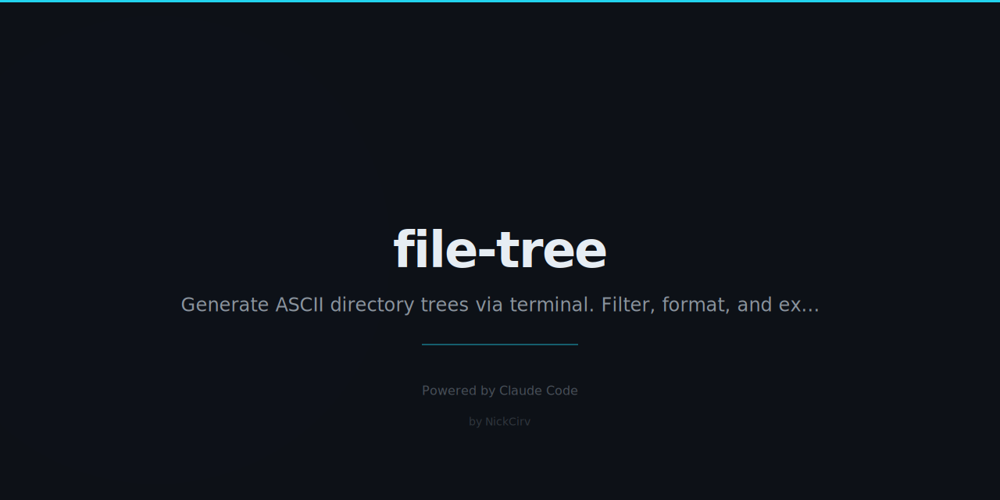

# file-tree

> Beautiful directory trees. Filter, format, export. Smarter than `tree`. Zero dependencies.

## Install

```bash
npx file-tree [path] [options]
```

Or install globally:

```bash
npm install -g file-tree
```

## Quick Start

```
src/
├── components/
│   ├── Button.tsx        2.1 KB
│   └── Input.tsx         1.8 KB
├── pages/
│   └── index.tsx         4.2 KB
└── utils/
    ├── api.ts            3.1 KB
    └── helpers.ts        1.2 KB

2 directories, 5 files
```

```bash
ftree              # current directory
ftree src/         # specific path
ftree --depth 2    # limit depth
ftree --size       # show file sizes
ftree --count      # show summary
```

## Options

| Flag | Description | Default |
|------|-------------|---------|
| `--depth <n>` | Limit tree depth | unlimited |
| `--ignore <patterns>` | Comma-separated ignore list | `node_modules,.git` |
| `--include <patterns>` | Only show matching files (e.g. `*.ts`) | all |
| `--dirs-only` | Only show directories | false |
| `--files-only` | Only show files, no dir lines | false |
| `--hidden` | Include hidden files/dirs | false |
| `--size` | Show file sizes | false |
| `--count` | Show file/dir count at bottom | false |
| `--format <fmt>` | Output format: `text`, `json`, `markdown`, `html` | `text` |
| `--output <file>` | Save output to file | stdout |
| `--sort <by>` | Sort by: `name`, `size`, `date` | `name` |
| `--max-files <n>` | Stop after N files | `1000` |
| `--help` | Show help | |
| `--version` | Show version | |

## Output Formats

### text (default)
ANSI colored output. Cyan = directories, white = files.

### json
Structured JSON tree — great for piping to `jq`:
```bash
ftree --format json | jq '.[] | .name'
```

### markdown
Wrapped in a fenced code block — paste directly into docs:
```bash
ftree --format markdown --output TREE.md
```

### html
Standalone HTML page with dark theme styling:
```bash
ftree --format html --output tree.html
```

## Examples

```bash
# Show TypeScript files only, 3 levels deep
ftree --include "*.ts,*.tsx" --depth 3

# Full project tree with sizes and count
ftree --ignore "node_modules,dist,.git,coverage" --size --count

# Export as markdown for docs
ftree src/ --format markdown --output docs/structure.md

# JSON output for scripting
ftree --format json --sort size | jq '.[0]'

# Everything, including hidden, sorted by date
ftree --hidden --sort date --count
```

---

Built with Node.js · Zero dependencies · MIT License
